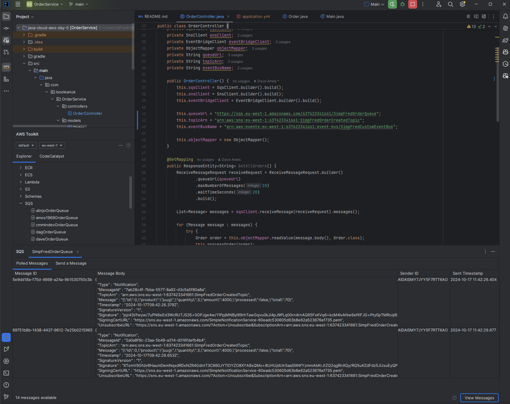

# JAVA Cloud AWS - Day Five




## Commands to Set Up SQS, SNS, and EventBridge

Note in Every command and URL being called there are fields that need to be replaced.

Example replacements (make sure to replace the curly brackets as well: don't keep curly brackets)

`{studentName}` - example `ajdewilzin` - this can be your name, independent of your login details

`{region}` - example `eu-north-1`

### Steps
1. Create an SNS Topic:

```bash
aws sns create-topic --name {studentName}OrderCreatedTopic
```
If successful, you will see in your terminal a JSON response that includes `"TopicArn": "...`.

Replace `topicArn` in your Controller code with the generated `TopicArn` value from above.

2. Create an SQS Queue:

```bash
aws sqs create-queue --queue-name {studentName}OrderQueue
```

If successful, you will see in your terminal a JSON response that includes `"QueueUrl": "some_aws_url`.

Replace `queueUrl` in your Controller code with the generated `QueueUrl` from the above command.


```bash
aws sns subscribe --topic-arn arn:aws:sns:{region}:637423341661:{studentName}OrderCreatedTopic --protocol sqs --notification-endpoint arn:aws:sqs:{region}:637423341661:{studentName}OrderQueue
```

You don't need to save the generated SubscriptionArn.

3. Create an EventBridge Event Bus:

```bash
aws events create-event-bus --name {StudentName}CustomEventBus --region {region}
```

4. Create an EventBridge Rule:

```bash
aws events put-rule --name {StudentName}OrderProcessedRule --event-pattern '{\"source\": [\"order.service\"]}' --event-bus-name {StudentName}CustomEventBus
```

If your terminal complains about double quotes, you might need to remove the backslash `\` from the command above (and commands later on).


5. Subscribe the SQS Queue to the SNS Topic

```bash
aws sqs get-queue-attributes --queue-url https://sqs.{region}.amazonaws.com/637423341661/{studentName}OrderQueue --attribute-name QueueArn --region {region}
```

```bash
aws sns subscribe --topic-arn arn:aws:sns:{region}:637423341661:{studentName}OrderCreatedTopic --protocol sqs --notification-endpoint arn:aws:sqs:{region}:637423341661:{studentName}OrderQueue --region {region}
```

6. Grant SNS Permissions to SQS

In Bash/Unix terminals you can run this command:

```bash
aws sqs set-queue-attributes --queue-url https://sqs.{region}.amazonaws.com/637423341661/{studentName}OrderQueue --attributes '{"Policy":"{\"Version\":\"2012-10-17\",\"Statement\":[{\"Effect\":\"Allow\",\"Principal\":{\"AWS\":\"*\"},\"Action\":\"SQS:SendMessage\",\"Resource\":\"arn:aws:sqs:{region}:637423341661:{studentName}OrderQueue\",\"Condition\":{\"ArnEquals\":{\"aws:SourceArn\":\"arn:aws:sns:{region}:637423341661:{studentName}OrderCreatedTopic\"}}}]}"}' --region {region}
```

## Core Exercise

Get the existing code working. 

## Extension Exercise

It works to an extent but there are limits and bugs, for instance it doensn't interact with the database.

1. Make the application store data into the database (this could be an RDS one or a Neon one)
2. Process orders and update the Total amount from QTY * AMOUNT plus
3. Add code to make it possible to update the existing orders in the database and remove the processed ones from the message queue
4. Improve the code in other ways
